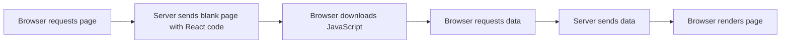
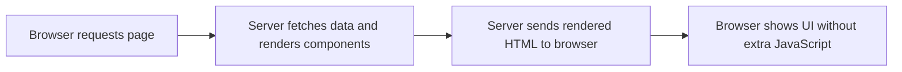

React is a popular library for building dynamic user interfaces. React has
traditionally run mainly in the browser, managing how they interact with the
application.

However, React **Server Components** (RSCs) represent a new way of doing things,
allowing parts of a React application to be rendered on the server instead of
the browser.

This means certain parts of your app's UI can be built and sent to the user
before their browser gets involved. 🤯

This results in **faster load times**, **better performance**, and **more
efficient handling of resources** like data fetching.

Imagine you're working on a project that needs to load a lot of data from a
database. With traditional React components (often called **Client
Components**), the browser first loads the page, then requests the data, and
then updates the UI. With **Server Components**, the server can fetch the data,
generate the interface, and send it to the user, fully ready to be displayed.
This is **before** the browser ever runs any JavaScript, **reducing the work the
user's device has to do**.

### Key Concepts

- **Server Components** are rendered on the server and do not need to load any
  JavaScript on the client.
- **Client Components** are rendered in the browser and rely on JavaScript to
  function.
- **Hybrid Apps** combine both Server and Client Components to offer the best
  performance and interactivity.

### How React Server Components Work

Here are two diagrams that illustrate the contrast between a
client-component-driven application and one that involves server components.

#### Traditional React App:



This process can cause delays, especially if your app requires a lot of data, or
if there is latency in the connection.

#### React Server Components App:



### The Benefits of React Server Components

1. **Improved Performance**: Since the heavy lifting is done on the server, your
   app can load faster, especially on older devices or poor network conditions.

2. **Smaller Bundle Size**: Server components don't need to send JavaScript to
   the browser, resulting in smaller file sizes and quicker load times. THIS IS
   HUGE 🥳

3. **Better SEO**: Search engines can crawl content that is rendered on the
   server, **making it easier for them to understand** and index your site. THIS
   IS ALSO HUGE ⚡️

4. **Efficient Data Fetching**: Data fetching happens on the server - where the
   data lives! This reduces redundant network requests and handle large data
   more efficiently.

### How to Use React Server Components

Here is what a server component might look in React:

```jsx
// This is a server component (by default)
export default async function ProductList() {
  const products = await fetch('https://api.example.com/products').then(
    response => response.json()
  )

  return (
    <ul>
      {products.map(product => (
        <li key={product.id}>{product.name}</li>
      ))}
    </ul>
  )
}
```

In this example, `ProductList` is a **server component**. It fetches data from
an API on the server, renders the list of products, and sends that list directly
to the browser as HTML. The browser doesn't need to request data or run
JavaScript for this to display.

### What About Client Components?

Client components still have their place. They handle interactivity—like
buttons, forms, or other elements that require interactivity. Everything cannot
be updated on the server since some parts of your UI need to update in real time
based on user actions.

Here’s an example of a client component:

```jsx
'use client' // This tells React that this component should run in the browser

export default function AddToCartButton({ productId }) {
  function handleAddToCart() {
    // logic to add the product to the user's cart
  }

  return <button onClick={handleAddToCart}>Add to Cart</button>
}
```

### When Should You Use Server vs Client Components?

Use Server Components when:

- Your component doesn't need interactivity (e.g. rendering a static list).
- You want to improve performance and load times. 🤔 WHY WOULD YOU NOT?
- You want to reduce the amount of JavaScript your app sends to the browser.
  DITTO.

Use Client Components when:

- Your component needs interactivity (like a button that changes style on click,
  or a form to be submitted).
- The component receives, but does not need to fetch, data.
- You want to reduce the amount of JavaScript your app sends to the browser.

The good news is that React client components can be rendered anywhere inside of
a server component. For example, inside a Header component (SC), the navigation
component can be a client component, allowing for interactivity and state.

### Finally

React Server Components enable the creation of fast, efficient web applications
by moving much of the work to the server.

By combining Server and Client Components, you can create apps that not only
perform well but also provide great user experiences.

If you're looking to boost performance and streamline your app, Server
Components the way to go!

---

### RSC Resources

Here are some cool resources to dive deeper into **React Server Components**:

### 1\. **React Official Documentation**

**React Server Components Working Group**: This is the best place to start. It’s
the in-depth documentation by React\'s core team on how Server Components work
and their advantages.

[React Working Group - Repo & Discussion](https://github.com/reactwg/server-components)

[React Server Components Documentation](https://react.dev/reference/rsc/server-components)

### 2\. **Next.js Documentation**

Since **Next.js** integrates React Server Components directly, it's a powerful
framework to explore RSCs in action. Their documentation includes information on
how to use Server Components with features like static rendering, routing, and
data fetching.

[Next.js React Server Components Documentation](https://nextjs.org/learn/react-foundations/server-and-client-components)

### 3\. **React Server Components Demo (GitHub)**

The official React team has released a demo on GitHub that shows how React
Server Components work with practical examples. You can explore this codebase to
see how server and client components are structured in a real-world app.

[React Server Components Demo Repository](https://github.com/reactjs/server-components-demo)

### 4\. **React Conf 2021 Talks on Server Components**

React Conf is a fantastic way to learn about new features directly from the
people who built them. The 2021 conference had several talks on React Server
Components, including how they fit into the future of React.

[React Server Components Talk at React Conf 2021](https://www.youtube.com/watch?v=ByBPyMBTzM0)

### 5\. **YouTube Tutorials and Channels**

**Ben Awad**: React expert who shares tutorials and videos on advanced topics,
including React Server Components.

[Ben Awad’s YouTube Channel](https://www.youtube.com/channel/UC-8QAzbLcRglXeN_MY9blyw)

**Fireship**: Quick, 100-second video explaining the basics of React Server
Components in an easy-to-understand format.

[React Server Components in 100 Seconds](https://www.youtube.com/watch?v=0e10eJ5Y5vE)

### 10\. **StackOverflow & GitHub Discussions**

Developers are posting interesting questions, challenges, and solutions about
Server Components.

[React Server Components Discussions on StackOverflow](https://stackoverflow.com/questions/tagged/react-server-components)

[React Server Components GitHub Discussions](https://github.com/reactjs/server-components/discussions)

Happy Serving!
